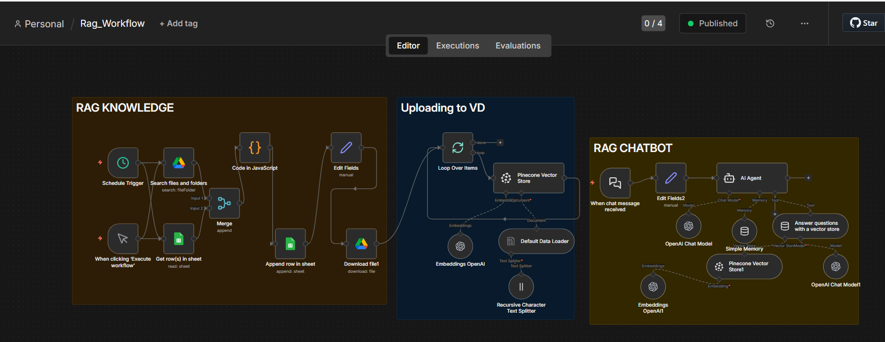
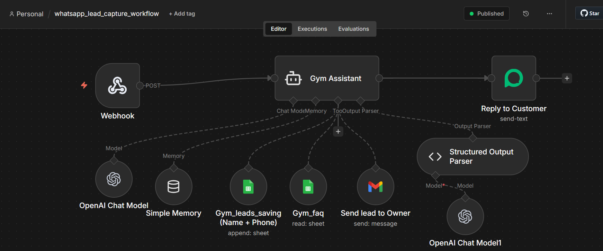

# n8n Projects

## 🚀 Projects

### 1️⃣ RAG Workflow
- Folder: `RAG/`
- File: `rag-document-retrieval-workflow.json`
- Features:
  - Automatic document ingestion
  - High retrieval accuracy
  - Multi-step workflow with logic branching
  - API-ready integration
  - ## 📸 Workflow Screenshot



### 🎥 Demo Video
[Watch RAG Workflow Demo](https://drive.google.com/file/d/12F_Amc7_MdWtWkjZJ_n_6dkXfhrz_5w_/view?usp=sharing)

### 2️⃣ WhatsApp Lead Capture Workflow
- Folder: `WhatsApp/`
- File: `whatsapp_lead_capture_workflow.json`
- Features:
  - Captures leads automatically from WhatsApp
  - Answers user questions using AI
  - Stores lead info via structured n8n workflow
  - Sends email notifications for new leads
  - Multi-step logic with integrations
  - API-ready for CRM or Google Sheets
  - ## 📸 Workflow Screenshot



### 🎥 Demo Video
[Watch WhatsApp Lead Capture Demo](https://drive.google.com/file/d/1u1U_oU16HVOsCGgcriSygLxluNof1NAC/view?usp=sharing)


## 🛠 Tech Stack
- n8n
- JavaScript nodes 
- OpenAI API

## 📂 Repository Structure
```
n8n_projects/
├─ RAG/
│ └─ rag-document-retrieval-workflow.json
├─ WhatsApp/
│ └─ whatsapp_lead_capture_workflow.json
├─ assets/
├─ src/
├─ README.md
├─ .gitignore
└─ LICENSE
```

## 📌 How It Works

## RAG Workflow
1. Documents ingested and processed  
2. Text embedded into vectors  
3. User queries trigger workflow  
4. Relevant context retrieved  
5. AI generates responses  

## WhatsApp Lead Capture Workflow
1. User sends a message via WhatsApp  
2. Workflow analyzes question using AI  
3. Lead info is captured and stored  
4. Email notification sent for new leads  
5. Data ready for CRM or Google Sheets

## ✨ Author
**M’hammed Bey Omar**  
Email: mhammed.beyomar@gmail.com
