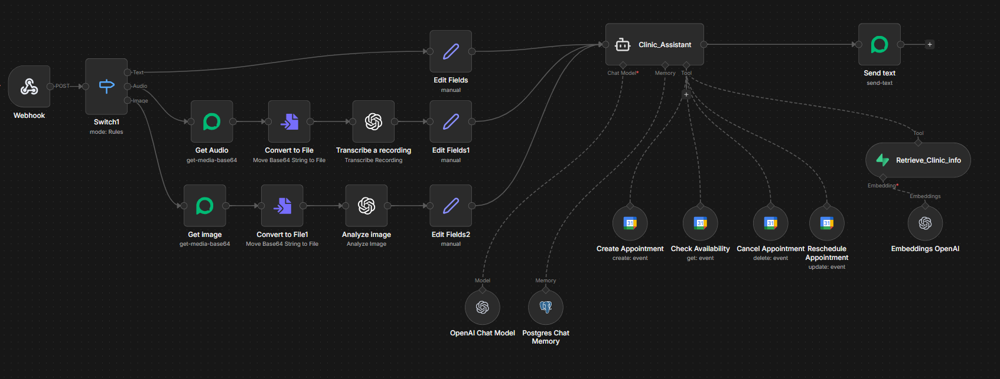
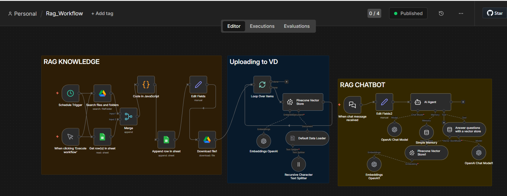
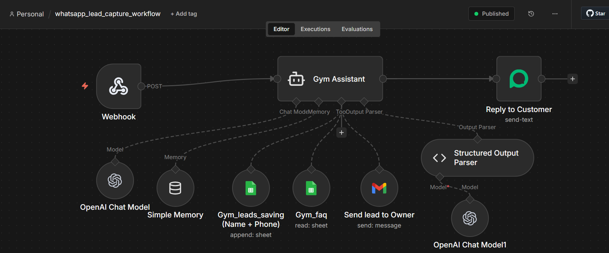

# n8n Projects

## 🚀 Projects

### 1️⃣ Clinic WhatsApp Assistant Workflow
- Folder: `ClinicWhatsApp/`
- File: `clinic_whatsapp_assistant_workflow.json`
- Features:
  - Fully automated AI-powered clinic assistant
  - Receives patient messages via WhatsApp
  - Answers questions about services, doctors, pricing, and FAQs using a vector knowledge base (Supabase + OpenAI embeddings)
  - Maintains chat memory per patient for multi-day conversations
  - Books, reschedules, and cancels appointments automatically via Google Calendar
  - Sends confirmation and reminder messages via WhatsApp
  - Multi-step workflow with logic branching
  - API-ready for integration with clinic systems
- ## 📸 Workflow Screenshot

### 🎥 Demo Video
[Watch Clinic WhatsApp Assistant Demo](#) 

### 2️⃣ RAG Workflow
- Folder: `RAG/`
- File: `rag-document-retrieval-workflow.json`
- Features:
  - Automatic document ingestion
  - High retrieval accuracy
  - Multi-step workflow with logic branching
  - API-ready integration
- ## 📸 Workflow Screenshot

### 🎥 Demo Video
[Watch RAG Workflow Demo](https://drive.google.com/file/d/12F_Amc7_MdWtWkjZJ_n_6dkXfhrz_5w_/view?usp=sharing)

### 3️⃣ WhatsApp Lead Capture Workflow
- Folder: `WhatsApp/`
- File: `whatsapp_lead_capture_workflow.json`
- Features:
  - Captures leads automatically from WhatsApp
  - Answers user questions using AI
  - Stores lead info via structured n8n workflow
  - Sends email notifications for new leads
  - Multi-step logic with integrations
  - API-ready for CRM or Google Sheets
- ## 📸 Workflow Screenshot

### 🎥 Demo Video
[Watch WhatsApp Lead Capture Demo](https://drive.google.com/file/d/1u1U_oU16HVOsCGgcriSygLxluNof1NAC/view?usp=sharing)

## 🛠 Tech Stack

- **n8n** – workflow automation  
- **JavaScript nodes** – custom logic in workflows  
- **OpenAI API** – embeddings and AI agent responses  
- **Supabase** – vector store for RAG + Postgres chat memory  
- **Pinecone** – optional vector database for semantic search  
- **Google Calendar nodes** – create, update, delete, and check appointments  
- **WhatsApp Evolution API** – patient communication

## 📂 Repository Structure

n8n_projects/
├─ ClinicWhatsApp/
│ └─ clinic_whatsapp_assistant_workflow.json
├─ RAG/
│ └─ rag-document-retrieval-workflow.json
├─ WhatsApp/
│ └─ whatsapp_lead_capture_workflow.json
├─ assets/
├─ src/
├─ README.md
├─ .gitignore
└─ LICENSE

## 📌 How It Works

### Clinic WhatsApp Assistant Workflow
1. Patient sends a message via WhatsApp  
2. Workflow analyzes the question using AI embeddings  
3. Patient info and conversation context stored in Supabase  
4. Workflow books/reschedules/cancels appointments via Google Calendar  
5. Sends confirmation and reminder messages via WhatsApp  
6. Data is ready for clinic CRM or other systems

### RAG Workflow
1. Documents ingested and processed  
2. Text embedded into vectors  
3. User queries trigger workflow  
4. Relevant context retrieved  
5. AI generates responses  

### WhatsApp Lead Capture Workflow
1. User sends a message via WhatsApp  
2. Workflow analyzes question using AI  
3. Lead info is captured and stored  
4. Email notification sent for new leads  
5. Data ready for CRM or Google Sheets

## ✨ Author
**M’hammed Bey Omar**  
Email: mhammed.beyomar@gmail.com
